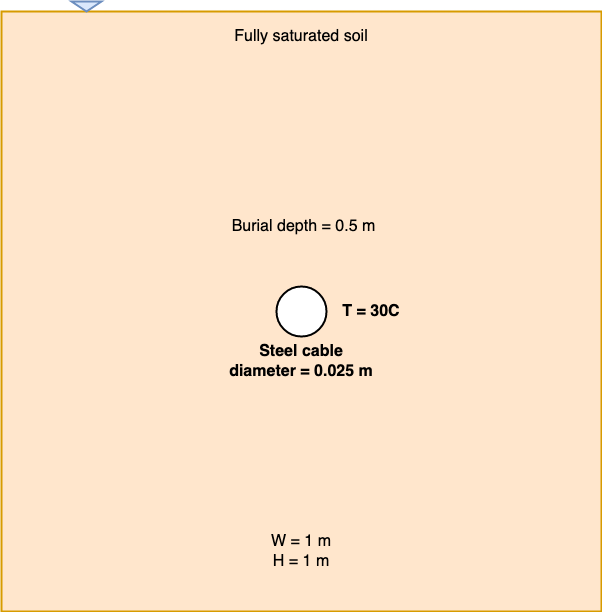

# Heat transfer around a cable
Using any language of your choice, develop a code to solve the heat transfer around a cable using Finite Difference. Solve the governing equation using a **forward-difference in time and second-order central-difference in space**. Plot the heat distribution around the cable. 

This task should not take more than a few days to complete. I expect and encourage you to ask any questions you may have or arise during this project. it is important that you reach out to me if you have any difficulties, because this reflects how we will work together during your PhD. 

**The goal of the project is not to test your existing knowledge, but to see how well we can work together and how you learn new concepts. Remember this is not an exam, please interact with Dr. Kumar as you explore this problem and attempt to solve it.**

## Governing equation
The heat transfer in the presence of a constant source $Q_{in}$ under steady-state is: 

$$Q_{in} = - \nabla^2 T + \alpha \mathbf{u} \cdot \nabla T$$

where, $T$ is Temperature (C), $\rho_f$ is the density of fluid (kg/m^3), and $\mathbf{u}$ is the fluid velocity (m/s). The right hand side of the heat equation represents the conductive ($- \nabla^2 T$) and convective ($ \rho_f c_{p_f} \mathbf{u} \cdot \nabla T$) heat transfer mechanisms. 

We assume the soil is fully saturated, i.e., the voids in the soil are filled with water. Darcy's law describes the fluid flow through the porous media:

$$u = - \frac{1}{n \mu} k \left(g \rho_{f_0} \left(1 - \beta (T - T_0)\right)\right)$$

where $u$ is the fluid flow velocity (m/s), $n$ is the porosity, $\mu$ dynamic viscosity (Pa.s), $k$ is the intrinsic permeability (m^2), $p$ is pressure (Pa), $\rho_{f_0}$ is the reference fluid density at ambient temperature, and $\beta$ is the volumetric coefficient of thermal expansion (1/K). 

In this problem, $Q_{in} = 0$. The source of heat is from the cable heated to a specific temperature below.

## Geometry and mesh configuration

Consider a soil domain of 1 m x 1 m. A 0.025 m diameter steel cable buried to a depth of 0.5 m is heated to 30 C. Evaluate the heat distribution around the cable with the following soil properties. 



### Properties
```python
# box size, m
w = h = 1

# intervals in x-, y- directions, m
dx = dy = 0.005

# Thermal conductivity W/(m-K)
thermal_conductivity = 1.602 

# Thermal diffusivity, m2.s-1
alphaSoil =  1.97e-7  # m^2/s

# Porosity
n = 0.45

# Viscosity kg/m
mu = 1.00E-03 

# Thermal expansion 
beta = 8.80E-05

# rhow
rhow = 980 # kg/m^3

# gravity
g = 9.81 # m/s^2

# permeability
permeability = 1e-12 # m^2
```

# Deliverables

1. Show the discretized form of the heat transfer PDE using central difference. 

2. Plot the heat transfer for three different permeability $k = 1e-8 m^2$, $1e-12 m^2$, and $1e-15 m^2$. No need to change porosity, while altering the permeability. Comment on why and how permeability will influence the porosity.

3. Code must be shared via Email or GitHub or Google Colab.

4. Explain how you will validate your code. 

# Evaluation criteria

1. Communication with Dr. Kumar during the task. This is the highest priority. You will be rated highly if you ask me questions, even simple ones like how to discretize the PDE, instead of sending me a completed code without talking to me once. 

2. Correctness of the finite difference derivation.

3. Heat transfer distribution around the cable for different permeabilities.

4. Quality and readability of heat transfer code.

# Useful references

* Emeana, C. J., Hughes, T. J., Dix, J. K., Gernon, T. M., Henstock, T. J., Thompson, C. E. L., & Pilgrim, J. A. (2016). The thermal regime around buried submarine high-voltage cables. Geophysical Journal International, 206(2), 1051-1064.

* Hughes, T. J., Henstock, T. J., Pilgrim, J. A., Dix, J. K., Gernon, T. M., & Thompson, C. E. (2015). Effect of sediment properties on the thermal performance of submarine HV cables. IEEE Transactions on Power Delivery, 30(6), 2443-2450.

* Kumar, K., El Mohtar, C., & Gilbert, R. (2022). Conductive and convective heat transfer in inductive heating of subsea buried pipelines. Journal of Pipeline Systems Engineering and Practice, 13(4), 04022031. https://arxiv.org/abs/2112.11826
